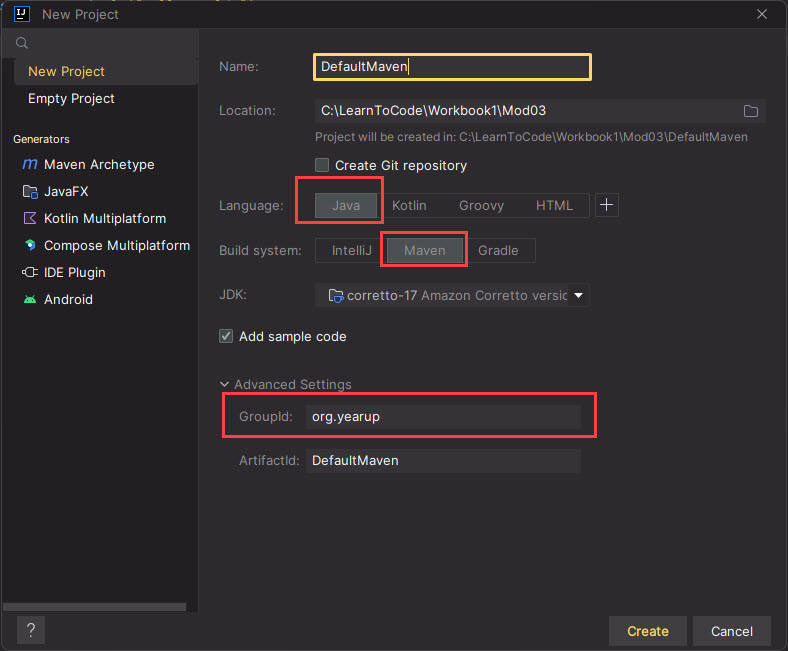
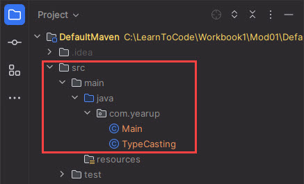

# Maven build project template

This project type uses the Maven build, and the folder structure is the standard Maven structure.

* All java packages and code files are added to the `src\main\java` folder.
* Test code files are added to the `src\test\java` folder.

