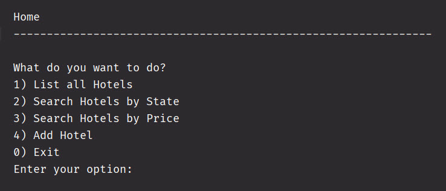
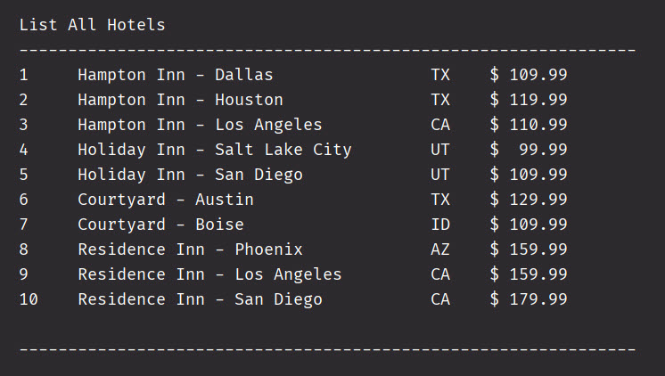
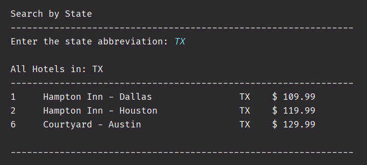
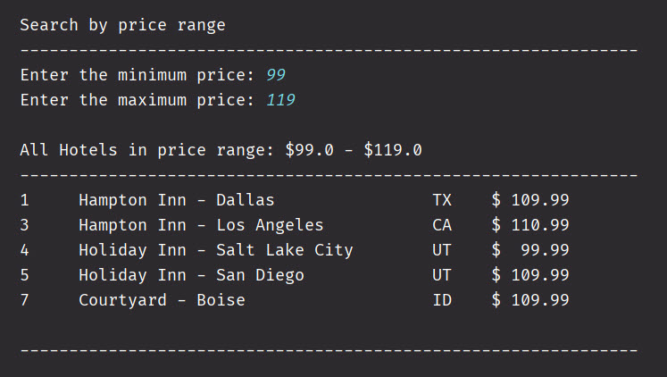
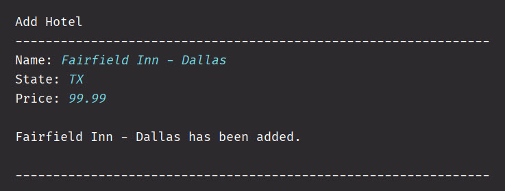

# Hotel Finder

This console application allows users to search a list of hotels. 
Users have the ability to:

1. List all hotels
2. Search by state
3. Search by price
4. Add a new hotel

## Interesting Code
An interesting piece of code in this application. 
Instead of looping through the entire array, I used a counter
variable to keep track of the last position that a hotel was added.
Each loop then uses that counter to determine how many times to loop.

```java
 for (int i = 0; i <= counter; i++)
 {
     Hotel hotel = hotels[i];
     // only include hotels in the state that the user entered
     if(hotel.getPrice() >= min && hotel.getPrice() <= max)
     {
         displayHotel(hotel);
     }
 }
```

## CLI Screens

### Home Screen



### List All



### Search by State



### Search by Price



### Add Hotel

